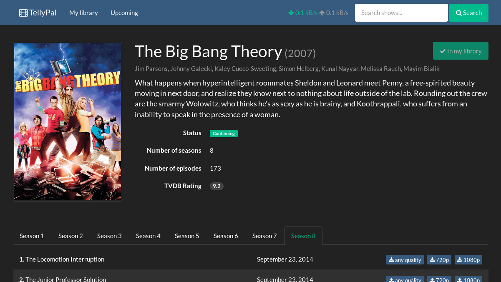

#TellyPal

TellyPal lets you comfortably manage your collection of your favourite tv
shows and easily download the latest episodes. It works as a thin layer over
[The TVDB](http://www.thetvdb.com), [Torrentz](http://torrentz.com)
and [Deluge BitTorrent Client](http://deluge-torrent.org/).
It is a multi-platform daemon that can be installed pretty much
anywhere and is accessed and controlled from a web browser.

_TellyPal is currently in the pre-alpha stage. Some features are implemented
and the software is ready to use, but it might require some extra care to get
it working_.

## Currently implemented features

* Searching/browsing **The TVDB**
* Adding tv shows to the local library
* Automatic updates of the local library
* Single-click episode download
* Basic control over underlying Deluge torrent client (start/pause, remove torrent)
* Responsive UI (support for phones & tablets)

## To be implemented (some day...)

* Automatic download of new released episodes
* Batch downloads of complete seasons or even shows
* Better library management (removing shows from the library...)
* Integration with XBMC
* Support for other torrent clients or torrent search engines

## How does it work

**The TVDB** is used as the main source for tv shows related information
(search, list of episodes, air dates, ratings, synopsis, actors...). When you
hit the download button to fetch a particular episode, the **torrentz** search
engine is used to find the most promising torrent for that episode (using
common search patterns as keywords). This might fail for obvious reasons
(such as that the episode is old and is no longer available as a single torrent
file). The found torrent is then passed to **Deluge client** which is
responsible for the actual download. TellyPal only works as a simplified UI
over the torrent client.

## Requirements

* [node.js](http://nodejs.org/)
* [Deluge BitTorrent Client](http://deluge-torrent.org/) installed and
configured
* [deluge-webapi plugin](https://github.com/idlesign/deluge-webapi) installed
and enabled
* Any modern web browser with web sockets support

## Installation

1. Download & unpack the repository
2. Go to the repository directory & run `npm install`
3. Check the `config.js` file and update it according to your needs
4. Run `grunt build` (if you have `grunt` installed globally; otherwise use
the binary inside `node_modules/grunt-cli/bin`).
5. Check that `deluged` and `deluge-web` are running and that the **Deluge:
Web UI** is connected to the `deluged` daemon (unfortunately, you have to do
this step for TellyPal)
6. Run `node index.js` to start the daemon
7. Access TellyPal from you web browser
(by default [http://localhost:3000] (http://localhost:3000))

If you want to play with the code, just run `grunt devel` to start a
dev server that will react to any changes you make to the code.